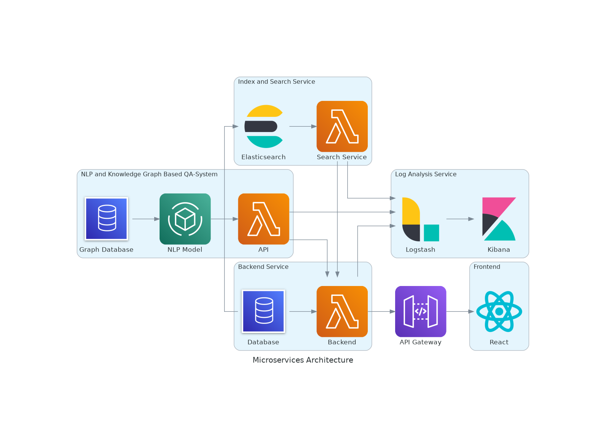

<p align="center">
	
</p>

# Medical System as a Service

> MSaaS is Laoheshan’s most technologically intelligent medical system. It's our course project for Software Engineering, but wen definitely wants to do something interesting.

A cross-platform medical system supporting iOS, Android, Web, and PWA.

## Features & Highlights

- Basic CRUD System with B/S, C/S Architecture
- Cross-Platform Ability Powered by React Native
- Video Diagnose Using WebRTC
- GraphDB & Deep-Learning Based AI Doctor
- Customable Information Visualization Using D3, ECharts, Leaflet and visx
- Intelligent API Maintainance with OpenAPI
- Cloud Native DevOps Development with GitHub Actions, Docker Registry and WatchTower
- ...

## Pipeline Status

| Parts                                                  | CI                                                           | CD                                                           |
| ------------------------------------------------------ | ------------------------------------------------------------ | ------------------------------------------------------------ |
| [Client](https://github.com/ZJU-SE-2021/MSaaS-Client)  | [](https://github.com/ZJU-SE-2021/MSaaS-Client/actions/workflows/run-test.yml) | [](https://github.com/ZJU-SE-2021/MSaaS-Client/actions/workflows/build-image.yml) |
| [Web](https://github.com/ZJU-SE-2021/MSaaS-Frontend)   | [](https://github.com/ZJU-SE-2021/MSaaS-Frontend/actions/workflows/run-test.yml) | [](https://github.com/ZJU-SE-2021/MSaaS-Frontend/actions/workflows/build-image.yml) |
| [Server](https://github.com/ZJU-SE-2021/MSaaS-Backend) | [](https://github.com/ZJU-SE-2021/MSaaS-Backend/actions/workflows/ci.yml) | [](https://github.com/ZJU-SE-2021/MSaaS-Backend/actions/workflows/cd.yml) |

## Deployment

You may deploy your own MSaaS instance using the following compose file.

```yaml
version: '3'

services:
  frontend:
    image: registry.cn-hangzhou.aliyuncs.com/ncj/msaas:latest
    restart: always
  client_web:
    image: registry.cn-hangzhou.aliyuncs.com/ncj/msaas_client:latest
    restart: always
  backend:
      image: registry.cn-hangzhou.aliyuncs.com/ncj/msaas_backend:latest
      restart: always
      depends_on: 
          - "db"
          - "redis"
      environment: 
          ConnectionStrings__Msaas: "Host=db;Database=msaas;Username=postgres;Password=${DB_PASSWORD}"
          ConnectionStrings__Redis: "redis:6379"
          JwtSettings__ExpiresIn: 604800
          JwtSettings__SigningKey: ${JWT_SIGNING_KEY}
          SubDirectory: "/api"
  db:
      image: postgres:13
      restart: always
      environment:
          POSTGRES_PASSWORD: ${DB_PASSWORD}
          POSTGRES_DB: msaas
      volumes:
          - data:/var/lib/postgresql/data
      command: postgres -c 'max_connections=1000'
  redis:
      image: redis:6-alpine
      restart: always
  graph_db:
      image: registry.cn-hangzhou.aliyuncs.com/ncj/msaas_chatterbot_graph:latest
      restart: always
  peerjs:
      image: peerjs/peerjs-server:0.6.1
      restart: always
      command: peerjs --port 9000 --key msaas_peerjs --path /peerjs
  chatter_bot_api:
      image: registry.cn-hangzhou.aliyuncs.com/ncj/msaas_chatterbot_api:latest
      restart: always
      depends_on: 
          - "graph_db"
      environment:
          NEO4J: "http://graph_db:7474"

volumes:
    data:
```

## Architecture



### Client Side

- Built with React Native and React Native Paper
- OpenAPI Generated Network SDK
- WebRTC with Native Support
- Unit Test with Jest

### Web Side

- Built with Ant Design Pro
- OpenAPI Generated Network SDK and TypeScript Document
- i18n Support
- WebRTC with Browser Support
- Information Visualization

### Server Side

- Built with ASP.NET 5
- Openbox OpenAPI 3 Support
- PostgreSQL for Database
- Redis for Cache
- ~~ELK for Logging~~ (consumes too much memory)
- Intergration Test with xUnit.net
- Stress Test with K6

### API Design

All API docs and SDKs are generated automatically with OpenAPI.
